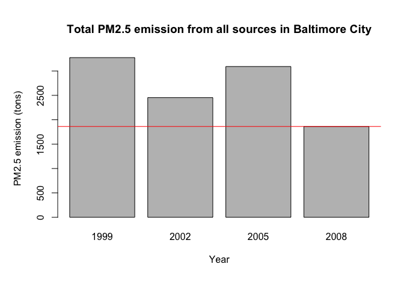
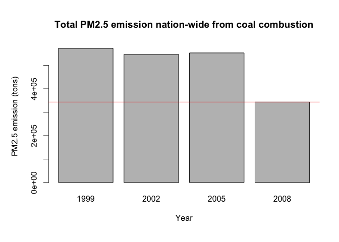

# Exploratory data analysis of US PM2.5 emission
Wei Wei  
April 16, 2016  


# Background information

Fine particulate matter (PM2.5) is an ambient air pollutant for which there is strong evidence that it is harmful to human health. In the United States, the Environmental Protection Agency (EPA) is tasked with setting national ambient air quality standards for fine PM and for tracking the emissions of this pollutant into the atmosphere. Approximatly every 3 years, the EPA releases its database on emissions of PM2.5. This database is known as the National Emissions Inventory (NEI). You can read more information about the NEI at the [EPA National Emissions Inventory web site][1].

For each year and for each type of PM source, the NEI records how many tons of PM2.5 were emitted from that source over the course of the entire year. The [data][2] used for this Coursera Data Science Specialization-Exploratory Data Analysis assignment are for 1999, 2002, 2005, and 2008.

[1]: https://www.epa.gov/air-emissions-inventories "EPA National Emissions Inventory web site"
[2]: https://d396qusza40orc.cloudfront.net/exdata%2Fdata%2FNEI_data.zip "data"

```r
rm(list=ls())

## download file
dataFileUrl <- 'https://d396qusza40orc.cloudfront.net/exdata%2Fdata%2FNEI_data.zip'

if (!dir.exists('../webData')) {dir.create('../webData')}
if (!file.exists('../webData/NEIdata.zip')) 
    {download.file(dataFileUrl, destfile='../webData/NEIdata.zip', method='curl')}

## unzip into working directory
unzip('../webData/NEIdata.zip')

## read both the data file and the code book
NEI <- readRDS('summarySCC_PM25.rds')
SCC <- readRDS('Source_Classification_Code.rds')
```

```r
str(NEI); str(SCC)
```

```
## 'data.frame':	6497651 obs. of  6 variables:
##  $ fips     : chr  "09001" "09001" "09001" "09001" ...
##  $ SCC      : chr  "10100401" "10100404" "10100501" "10200401" ...
##  $ Pollutant: chr  "PM25-PRI" "PM25-PRI" "PM25-PRI" "PM25-PRI" ...
##  $ Emissions: num  15.714 234.178 0.128 2.036 0.388 ...
##  $ type     : chr  "POINT" "POINT" "POINT" "POINT" ...
##  $ year     : int  1999 1999 1999 1999 1999 1999 1999 1999 1999 1999 ...
```

```
## 'data.frame':	11717 obs. of  15 variables:
##  $ SCC                : Factor w/ 11717 levels "10100101","10100102",..: 1 2 3 4 5 6 7 8 9 10 ...
##  $ Data.Category      : Factor w/ 6 levels "Biogenic","Event",..: 6 6 6 6 6 6 6 6 6 6 ...
##  $ Short.Name         : Factor w/ 11238 levels "","2,4-D Salts and Esters Prod /Process Vents, 2,4-D Recovery: Filtration",..: 3283 3284 3293 3291 3290 3294 3295 3296 3292 3289 ...
##  $ EI.Sector          : Factor w/ 59 levels "Agriculture - Crops & Livestock Dust",..: 18 18 18 18 18 18 18 18 18 18 ...
##  $ Option.Group       : Factor w/ 25 levels "","C/I Kerosene",..: 1 1 1 1 1 1 1 1 1 1 ...
##  $ Option.Set         : Factor w/ 18 levels "","A","B","B1A",..: 1 1 1 1 1 1 1 1 1 1 ...
##  $ SCC.Level.One      : Factor w/ 17 levels "Brick Kilns",..: 3 3 3 3 3 3 3 3 3 3 ...
##  $ SCC.Level.Two      : Factor w/ 146 levels "","Agricultural Chemicals Production",..: 32 32 32 32 32 32 32 32 32 32 ...
##  $ SCC.Level.Three    : Factor w/ 1061 levels "","100% Biosolids (e.g., sewage sludge, manure, mixtures of these matls)",..: 88 88 156 156 156 156 156 156 156 156 ...
##  $ SCC.Level.Four     : Factor w/ 6084 levels "","(NH4)2 SO4 Acid Bath System and Evaporator",..: 4455 5583 4466 4458 1341 5246 5584 5983 4461 776 ...
##  $ Map.To             : num  NA NA NA NA NA NA NA NA NA NA ...
##  $ Last.Inventory.Year: int  NA NA NA NA NA NA NA NA NA NA ...
##  $ Created_Date       : Factor w/ 57 levels "","1/27/2000 0:00:00",..: 1 1 1 1 1 1 1 1 1 1 ...
##  $ Revised_Date       : Factor w/ 44 levels "","1/27/2000 0:00:00",..: 1 1 1 1 1 1 1 1 1 1 ...
##  $ Usage.Notes        : Factor w/ 21 levels ""," ","includes bleaching towers, washer hoods, filtrate tanks, vacuum pump exhausts",..: 1 1 1 1 1 1 1 1 1 1 ...
```
NEI is a data.frame table of 6497651 rows x 6 columns; SCC is a data.frame table of 11717 rows x 15 columns.


```r
table(is.na(NEI$year)); table(is.na(NEI$Emissions))
```

```
## 
##   FALSE 
## 6497651
```

```
## 
##   FALSE 
## 6497651
```
There are no missing data (NAs) in the "year" and "Emissions" columns in the NEI table.

### Q: Have total emissions from PM2.5 decreased in the United States from 1999 to 2008?
    

```r
suppressPackageStartupMessages(library(dplyr))

annualSum <- NEI %>% group_by(year) %>% summarize(total=sum(Emissions))
annualSum <- transform(annualSum, year=factor(year))

# plotting using the base plot system
par(mar=c(6, 5, 5, 2 ))
barplot(annualSum$total, names=annualSum$year, xlab="Year", ylab="PM2.5 emission (tons)")
title(main="Total PM2.5 emission nation-wide from all sources")
abline(h=annualSum[annualSum$year==2008, ]$total, col="red")
```


    
### Q: Have total emissions from PM2.5 decreased in the Baltimore City, Maryland (fips == "24510") from 1999 to 2008?
      

```r
library(dplyr)
annualSumBC <- NEI %>% filter(fips=="24510") %>% group_by(year) %>% summarize(total=sum(Emissions))
annualSumBC <- transform(annualSumBC, year=factor(year))

# plotting using the base plot system
par(mar=c(6, 5, 5, 2 ))
barplot(annualSumBC$total, names=annualSumBC$year, xlab="Year", ylab="PM2.5 emission (tons)")
title(main="Total PM2.5 emission from all sources in Baltimore City")
abline(h=annualSumBC[annualSumBC$year==2008, ]$total, col="red")
```


    
### Q: Of the four types of sources indicated by the type (point, nonpoint, onroad, nonroad) variable, which of these four sources have seen decreases in emissions from 1999–2008 for Baltimore City? Which have seen increases in emissions from 1999–2008?
    

```r
library(dplyr)
NEI_BC <- NEI %>% filter(fips=="24510") %>% group_by(type, year) %>% summarize(total=sum(Emissions))
NEI_BC <- transform(NEI_BC, type=factor(type), year=factor(year))
NEI_BC2008 <- subset(NEI_BC, year==2008)

## plotting using the ggplot2 plot system
library(ggplot2)
g <- ggplot(NEI_BC, aes(year, total)) + facet_grid(.~type)
g <- g + geom_bar(stat="identity", alpha=0.75, fill="steelblue")
g <- g + geom_hline(data=NEI_BC2008, aes(yintercept=NEI_BC2008$total), col="red")
g <- g + labs(x="Year", y="PM2.5 emission (tons)") + labs(title="Total PM2.5 emission in Baltimore City by source type")
print(g)
```


    
### Q: Across the United States, how have emissions from coal combustion-related sources changed from 1999–2008?
    

```r
## 1st, subset SCC that contains both "Coal" and "Comb" in the EI.Sector column
## 2nd, merge NEI and SCC subsetted data

library(dplyr, warn.conflicts=F)
levels(SCC$EI.Sector)[10:20]
```

```
##  [1] "Fires - Prescribed Fires"                     
##  [2] "Fires - Wildfires"                            
##  [3] "Fuel Comb - Comm/Institutional - Biomass"     
##  [4] "Fuel Comb - Comm/Institutional - Coal"        
##  [5] "Fuel Comb - Comm/Institutional - Natural Gas" 
##  [6] "Fuel Comb - Comm/Institutional - Oil"         
##  [7] "Fuel Comb - Comm/Institutional - Other"       
##  [8] "Fuel Comb - Electric Generation - Biomass"    
##  [9] "Fuel Comb - Electric Generation - Coal"       
## [10] "Fuel Comb - Electric Generation - Natural Gas"
## [11] "Fuel Comb - Electric Generation - Oil"
```

```r
SCC_Coal <- SCC %>% filter(grepl("Coal", EI.Sector, ignore.case=TRUE) & grepl("Comb", EI.Sector, ignore.case=T))

# remove the original number of factor levels in the SCC column variable by coversion to character class
SCC_Coal$SCC <- as.character(SCC_Coal$SCC)

# inner join NEI, SCC_Coal on SCC column
NEI_Coal <- inner_join(NEI, SCC_Coal, by="SCC")

# annual total coal combustion 
annualSumCoal <- NEI_Coal %>% group_by(year) %>% summarize(total=sum(Emissions))
annualSumCoal <- transform(annualSumCoal, year=factor(year))

# plotting using the base plot system
par(mar=c(6, 5, 5, 2 ))
barplot(annualSumCoal$total, names=annualSumCoal$year, xlab="Year", ylab="PM2.5 emission (tons)")
title(main="Total PM2.5 emission nation-wide from coal combustion")
abline(h=annualSumCoal[annualSumCoal$year==2008, ]$total, col="red")
```


   
### Q: How have emissions from motor vehicle sources changed from 1999–2008 in Baltimore City?
    

```r
SCC_Vehicle <- SCC %>% filter(grepl("Vehicle", EI.Sector, ignore.case=TRUE))
SCC_Vehicle$SCC <- as.character(SCC_Vehicle$SCC)
NEI_Vehicle <- inner_join(NEI, SCC_Vehicle, by="SCC")

annualSumVehicleBC <- NEI_Vehicle %>% filter(fips=="24510") %>% group_by(year) %>% summarize(total=sum(Emissions))
annualSumVehicleBC <- transform(annualSumVehicleBC, year=factor(year))

# plotting using the base plot system
par(mar=c(6, 5, 5, 2 ))
barplot(annualSumVehicleBC$total, names=annualSumVehicleBC$year, xlab="Year", ylab="PM2.5 emission (tons)")
title(main="Total PM2.5 emission from motor vehicles in Baltimore City")
abline(h=annualSumVehicleBC[annualSumVehicleBC$year==2008, ]$total, col="red")
```


    
### Q: Compare emissions from motor vehicle sources in Baltimore City with emissions from motor vehicle sources in Los Angeles County, California (fips == "06037"). Which city has seen greater changes over time in motor vehicle emissions?
    

```r
SCC_Vehicle <- SCC %>% filter(grepl("Vehicle", EI.Sector, ignore.case=TRUE))
SCC_Vehicle$SCC <- as.character(SCC_Vehicle$SCC)
NEI_Vehicle <- inner_join(NEI, SCC_Vehicle, by="SCC")

NEI_BC_LA_Vehicle <- NEI_Vehicle %>% filter(fips %in% c("24510", "06037"))
NEI_BC_LA_Vehicle <- transform(NEI_BC_LA_Vehicle, fips=factor(fips), year=factor(year))

annualSumVehicle <- NEI_BC_LA_Vehicle %>% group_by(fips, year) %>% summarize(total=sum(Emissions))
levels(annualSumVehicle$fips) <- c("Los Angeles County", "Baltimore City")
sumVehicle2008 <- annualSumVehicle[annualSumVehicle$year=="2008", ]

# plotting using the ggplot2 plot system
library(ggplot2)
g <- ggplot(annualSumVehicle, aes(year, total)) + facet_grid(.~fips)
g <- g + geom_bar(stat="identity", alpha=0.75, fill="steelblue")
g <- g + geom_hline(data=sumVehicle2008, aes(yintercept=sumVehicle2008$total), col="red")
g <- g + labs(x="Year", y="PM2.5 emission (tons)") 
g <- g + labs(title="Total motor vehicle PM2.5 emission in Los Angeles vs in Baltimore City")
print(g)
```


